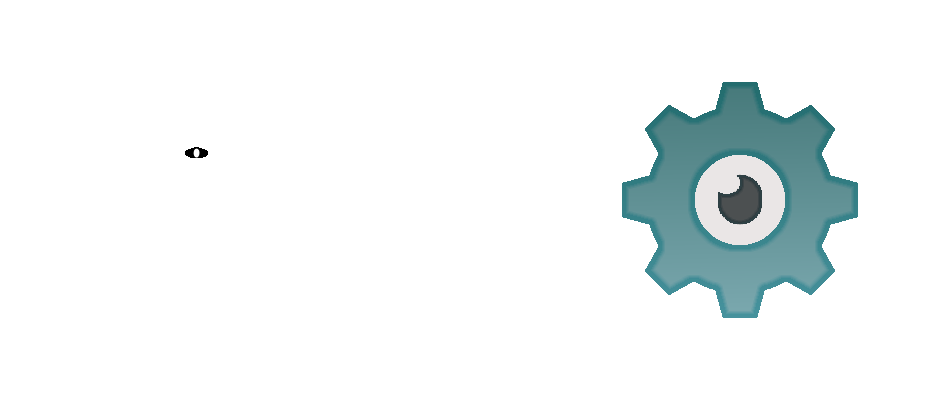

*Vulkan Interface System And Graphics Engine*

*Logo made by: [44](https://github.com/44ang3ls)*

# High-performance graphics engine made in Vulkan

- Visage is a high-performance graphics engine created for the sole purpose to learn all about GPU programming and [Vulkan](https://www.vulkan.org/)
- This project is a faster, cleaned up, and more realistic version of my old graphics engine: [3d-vulkan](https://github.com/DrewLedge/3d-vulkan)

## Notable features
- Two rendering modes: Raytracing & Rasterization
- Fully real-time lighting, object manipulation, and raytracing
- Very efficient GPU utilization
- Deferred rendering
- Custom math library

**Note: This project is primarily a learning experience and may lack features found in full-fledged graphics engines**

## Raytracing ON

  
  
  

## Raytracing OFF

  
  
  

## Dependencies
- [Vulkan SDK](https://vulkan.lunarg.com/)

## 3rd-party libraries used:
- [GLFW](https://github.com/glfw/glfw)
- [ImGui](https://github.com/ocornut/imgui)
- [TinyGLTF](https://github.com/syoyo/tinygltf)
- [STB Image](https://github.com/nothings/stb)
